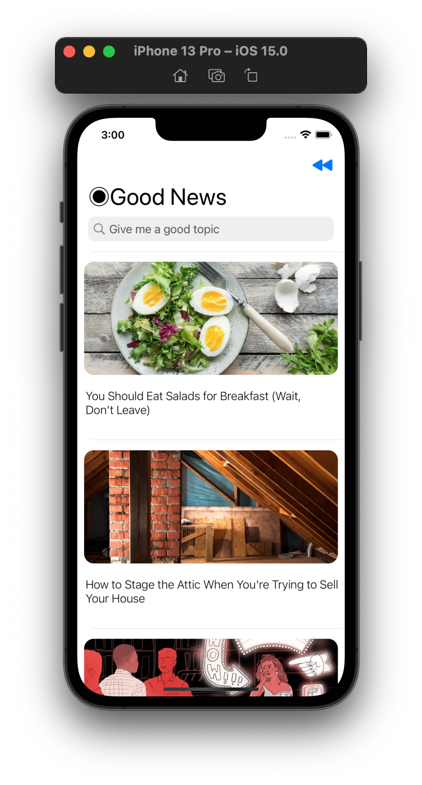
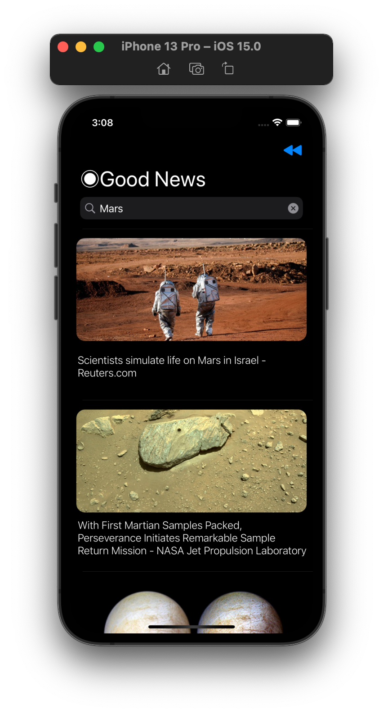
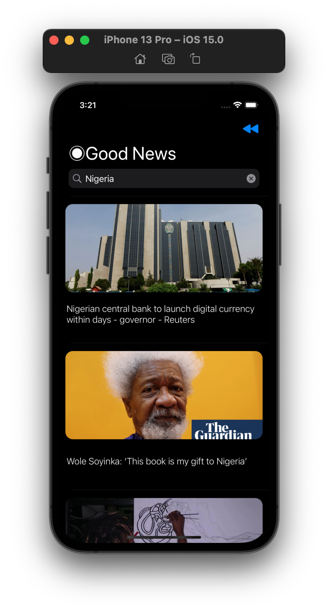
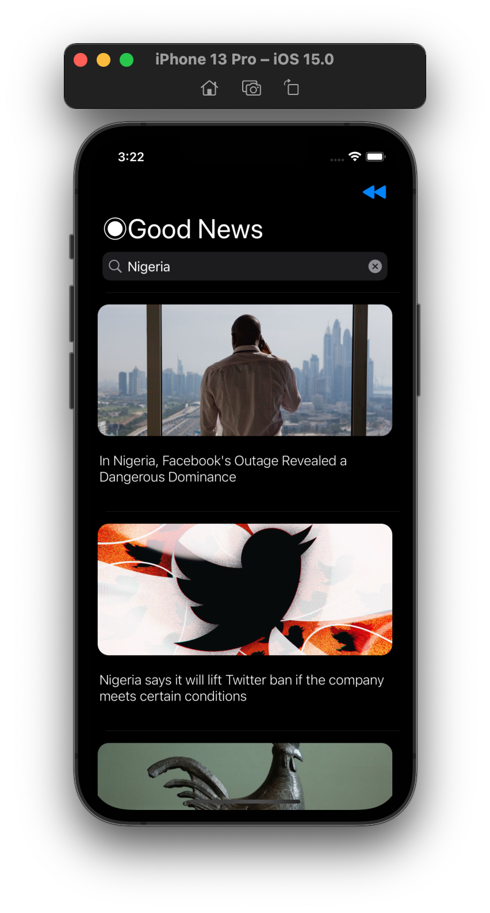
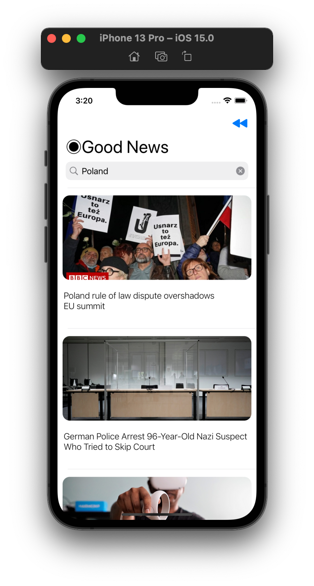

# Good News iOS Application Using Machine Learning 
The project entails creating an iOS application that uses an API to identify only positive articles. The sentiment analysis inference is performed on the articles's texts using built-in ```Natural Language``` Processing algorithm. 
## Overview
1) Get the key for a news API Key
2) Create iOS application using tableView
3) Create a decodable to parse the API calls
4) Use Swift's NLP algorithm on articles' description
5) Customize the feed view creating custom Cell
6) Create a search bar to fetch more news

## Final Result


## Extra Feature
In case users may want to see the bad news on a particular topic or in general, there is a button on the top right side.\
Going back from bad news to Good News is to swipe the table view down and refresh it.\


### Requirements:
Install Xcode 13\
Copy and clone the project\
Register an API key at https://newsapi.org/ \
Paste the API Key inside APICaller.swift\
Build and run the project

### About Me:
**Muhammed Raşit Öner** - [LinkedIn](https://www.linkedin.com/in/rasit-oner-2aa64b1a4/) \
This project is a part of my ```Bachelor Thesis``` at Wrocław University of Science and Technology.


